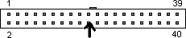
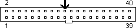
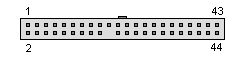
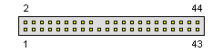
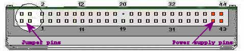

# HDD ATA

## 40-pin IDE/ATA Connections for 3.5" Desktop Hard Drives

### Female

### Male

### Notes

* Pin/Slot 20 (arrowed above) may have an absent pin or be blanked of as a key identifier. It carries no data nor power.
* The outside notch beside Pins/Slots 19 and 21 may or may not be present.
* The ribbon cable normally has a red line going to Pin/Slot 1.

## 44-pin IDE/ATA Connections for 2.5" Laptop Hard Drives

### Female

### Male

### Notes

The first 40 are the same as their desktop cousins but there are an additional four pins (41 to 44) which use 5V power normally carried by a molex connector on a desktop hard drive.
Don't confuse the four pins (41 to 44) with another bank of four pins (- usually separated from the other 44 pins by a gap -) which are for jumpering the laptop hard drive. These are usually not jumpered at all on laptop hard drives.

# pinouts

<table border="1">
  <tbody>
    <tr>
      <th>Pin</th>
      <th>Name</th>
      <th>Dir</th>
      <th>Description</th>
    </tr>
    <tr>
      <td>1</td>
      <td>/RESET</td>
      <td>OUT</td>
      <td>Reset</td>
    </tr>
    <tr>
      <td>2</td>
      <td>GND</td>
      <td>------</td>
      <td>Ground</td>
    </tr>
    <tr>
      <td>3</td>
      <td>DD7</td>
      <td>IN/OUT</td>
      <td>Data 7</td>
    </tr>
    <tr>
      <td>4</td>
      <td>DD8</td>
      <td>IN/OUT</td>
      <td>Data 8</td>
    </tr>
    <tr>
      <td>5</td>
      <td>DD6</td>
      <td>IN/OUT</td>
      <td>Data 6</td>
    </tr>
    <tr>
      <td>6</td>
      <td>DD9</td>
      <td>IN/OUT</td>
      <td>Data 9</td>
    </tr>
    <tr>
      <td>7</td>
      <td>DD5</td>
      <td>IN/OUT</td>
      <td>Data 5</td>
    </tr>
    <tr>
      <td>8</td>
      <td>DD10</td>
      <td>IN/OUT</td>
      <td>Data 10</td>
    </tr>
    <tr>
      <td>9</td>
      <td>DD4</td>
      <td>IN/OUT</td>
      <td>Data 4</td>
    </tr>
    <tr>
      <td>10</td>
      <td>DD11</td>
      <td>IN/OUT</td>
      <td>Data 11</td>
    </tr>
    <tr>
      <td>11</td>
      <td>DD3</td>
      <td>IN/OUT</td>
      <td>Data 3</td>
    </tr>
    <tr>
      <td>12</td>
      <td>DD12</td>
      <td>IN/OUT</td>
      <td>Data 12</td>
    </tr>
    <tr>
      <td>13</td>
      <td>DD2</td>
      <td>IN/OUT</td>
      <td>Data 2</td>
    </tr>
    <tr>
      <td>14</td>
      <td>DD13</td>
      <td>IN/OUT</td>
      <td>Data 13</td>
    </tr>
    <tr>
      <td>15</td>
      <td>DD1</td>
      <td>IN/OUT</td>
      <td>Data 1</td>
    </tr>
    <tr>
      <td>16</td>
      <td>DD14</td>
      <td>IN/OUT</td>
      <td>Data 14</td>
    </tr>
    <tr>
      <td>17</td>
      <td>DD0</td>
      <td>IN/OUT</td>
      <td>Data 0</td>
    </tr>
    <tr>
      <td>18</td>
      <td>DD15</td>
      <td>IN/OUT</td>
      <td>Data 15</td>
    </tr>
    <tr>
      <td>19</td>
      <td>GND</td>
      <td>------</td>
      <td>Ground</td>
    </tr>
    <tr>
      <td>20</td>
      <td>KEY</td>
      <td>-</td>
      <td>Key</td>
    </tr>
    <tr>
      <td>21</td>
      <td>n/c</td>
      <td>-</td>
      <td>Not connected</td>
    </tr>
    <tr>
      <td>22</td>
      <td>GND</td>
      <td>------</td>
      <td>Ground</td>
    </tr>
    <tr>
      <td>23</td>
      <td>/IOW</td>
      <td>OUT</td>
      <td>Write Strobe</td>
    </tr>
    <tr>
      <td>24</td>
      <td>GND</td>
      <td>------</td>
      <td>Ground</td>
    </tr>
    <tr>
      <td>25</td>
      <td>/IOR</td>
      <td>OUT</td>
      <td>Read Strobe</td>
    </tr>
    <tr>
      <td>26</td>
      <td>GND</td>
      <td>------</td>
      <td>Ground</td>
    </tr>
    <tr>
      <td>27</td>
      <td>IO_CH_RDY</td>
      <td>IN</td>
      <td>&nbsp;</td>
    </tr>
    <tr>
      <td>28</td>
      <td>ALE</td>
      <td>OUT</td>
      <td>Address Latch Enable</td>
    </tr>
    <tr>
      <td>29</td>
      <td>n/c</td>
      <td>-</td>
      <td>Not connected</td>
    </tr>
    <tr>
      <td>30</td>
      <td>GND</td>
      <td>------</td>
      <td>Ground</td>
    </tr>
    <tr>
      <td>31</td>
      <td>IRQR</td>
      <td>IN</td>
      <td>Interrupt Request</td>
    </tr>
    <tr>
      <td>32</td>
      <td>/IOCS16</td>
      <td>?</td>
      <td>IO ChipSelect 16</td>
    </tr>
    <tr>
      <td>33</td>
      <td>DA1</td>
      <td>OUT</td>
      <td>Address 1</td>
    </tr>
    <tr>
      <td>34</td>
      <td>n/c</td>
      <td>-</td>
      <td>Not connected</td>
    </tr>
    <tr>
      <td>35</td>
      <td>DA0</td>
      <td>OUT</td>
      <td>Address 0</td>
    </tr>
    <tr>
      <td>36</td>
      <td>DA2</td>
      <td>OUT</td>
      <td>Address 2</td>
    </tr>
    <tr>
      <td>37</td>
      <td>/IDE_CS0</td>
      <td>OUT</td>
      <td>(1F0-1F7)</td>
    </tr>
    <tr>
      <td>38</td>
      <td>/IDE_CS1</td>
      <td>OUT</td>
      <td>(3F6-3F7)</td>
    </tr>
    <tr>
      <td>39</td>
      <td>/ACTIVE</td>
      <td>OUT</td>
      <td>Led driver</td>
    </tr>
    <tr>
      <td>40</td>
      <td>GND</td>
      <td>------</td>
      <td>Ground</td>
    </tr>
    <tr>
      <td style="color: rgb(255, 0, 0);">41</td>
      <td style="color: rgb(255, 0, 0);">+5VL</td>
      <td style="color: rgb(255, 0, 0);">----&gt;</td>
      <td style="color: rgb(255, 0, 0);">+5VC (Logic)</td>
    </tr>
    <tr>
      <td style="color: rgb(255, 0, 0);">42</td>
      <td style="color: rgb(255, 0, 0);">+5VM</td>
      <td style="color: rgb(255, 0, 0);">-----&gt;</td>
      <td style="color: rgb(255, 0, 0);">+5VC (Motor)</td>
    </tr>
    <tr>
      <td style="color: rgb(255, 0, 0);">43</td>
      <td style="color: rgb(255, 0, 0);">GND</td>
      <td style="color: rgb(255, 0, 0);">------</td>
      <td style="color: rgb(255, 0, 0);">Ground</td>
    </tr>
    <tr>
      <td style="color: rgb(255, 0, 0);">44</td>
      <td style="color: rgb(255, 0, 0);">/TYPE</td>
      <td style="color: rgb(255, 0, 0);">-----&gt;</td>
      <td style="color: rgb(255, 0, 0);">Type (0=ATA)</td>
    </tr>
  </tbody>
</table>
