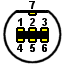

# Gamecube controllers

## Connector (Controller side)

| Pin | Color[1]  | Color[2]   | J1 | Function                                                            |
| --- | --------- | ---------- | -- | ------------------------------------------------------------------- |
| 1   | Yellow    | White      | 2  | 5V                                                                  |
| 2   | Red       | Red/Orange | 3  | DATA line: bi-directional data to/from console, pull-up to 3.43V    |
| 3   | Green     | Yellow     | 4  | Ground.                                                             |
| 4   | White     | Yellow     | 5  | Ground (Skillz interface has pins 3+4 wired as common ground).      |
| 5   | -         |            | -  | Unknown: not connected by official controller, or Skillz interface. |
| 6   | Blue      | Green      | 1  | 3.43V logic supply.                                                 |
| 7   | Black     |            | 6  | Cable shielding / ground. Usually common ground with pin 3.         |

[1] Original pad
[2] Extension

## references

http://www.int03.co.uk/crema/hardware/gamecube/gc-control.htm

[Gamecube to bluetooth](https://github.com/NathanReeves/BlueCubeMod)
