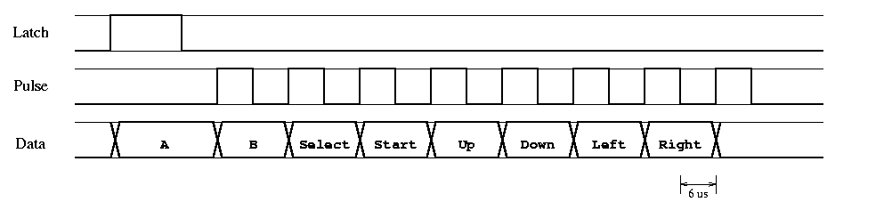

# Nintendo nes controller

## NES-004 / NES-004E

## Connector / Socket

### Console/Pad side

```
╭──────╮
│○○○○ ╱
│○○○ ╱
╰───╯

╭──────╮
│1234 ╱
│567 ╱
╰───╯
```

### Cable


| Pin | What   | Color [2] | Color [1] |
| --- | ------ | --------- | --------- |
|  1  | Data   | Red       | Black     |
|  2  | Latch  | Black     | Yellow    |
|  3  | Clock  | Orange    | Green     |
|  4  | Ground | Brown     | White     |
|  5  | D4     | Green     | ?         |
|  6  | D3     | Blue      | ?         |
|  7  | VCC 5v | Yellow    | Red       |

[1] Original pad
[2] Extension:  I test two extensions from different sources (chinesee),
same layout maybe I'm lucky :)

*NOTE* Nintendo original VCC is 5v, but works with 3.3v

### Protocol

The NES controller use a shift register: 4021

The NES main unit polls data at 60 Hz (NTSC) 50 Hz (Europe)



| Signals                           | Button Reported    |
| --------------------------------- | ------------------ |
| Latch  (12μs high, read, 6μs low) | A                  |
| Clock 1 (6μs high, read, 6μs low) | B                  |
| Clock 2 (6μs high, read, 6μs low) | Select             |
| Clock 3 (6μs high, read, 6μs low) | Start              |
| Clock 4 (6μs high, read, 6μs low) | Up on joypad       |
| Clock 5 (6μs high, read, 6μs low) | Down on joypad     |
| Clock 6 (6μs high, read, 6μs low) | Left on joypad     |
| Clock 7 (6μs high, read, 6μs low) | Right on joypad    |
| Clock 8 (6μs high, read, 6μs low) | None, but needed   |

*NOTE* I read in many sites, that there is 7 clock pulses.
You need 8 for `nes-004e` and other generic controllers.
If you don't send it the shift register doesn't properly reset...

## Four score protocol

TODO

## Light Gun protocol (Zapper)

TODO

## References

* [read nes controller with arduino](https://www.allaboutcircuits.com/projects/nes-controller-interface-with-an-arduino-uno/)

* [nes controllers info](http://problemkaputt.de/everynes.htm#controllersjoypads)

* [four score protocol](http://wiki.nesdev.com/w/index.php/Four_Score)

* [Original wire colors, controller circuit, protocol (not 100% accurate)](http://uzebox.org/files/NES-controller-Hydra-Ch6All-v1.0.pdf)

* [General information](https://tresi.github.io/nes/)

* [NES Controller Compatibility](https://tetrissuomi.wordpress.com/english/nes-controller-compatibility/)

* [Zapper on LCD](http://neslcdmod.com/)
