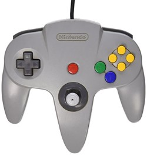
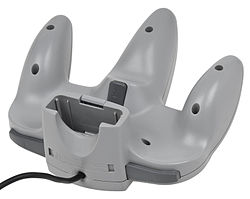
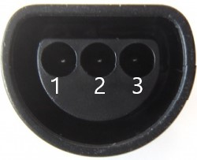
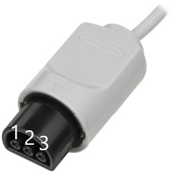
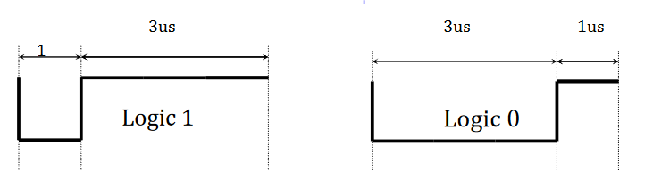

# nintendo 64 controllers

## nintendo 64 controller socket

Console side

* 1: Vcc (3.3v)
* 2: Signal
* 3: Ground

Controller side:

* 1: Ground
* 2: Signal
* 3: Vcc (3.3v)

## Protocol

In its idle state the data line is high ( 3,6 V).

Each bit that is transmitted takes 4 μs of time.

| value | secuence |
|-------|----------|
| 1     | 0 1 1 1  |
| 0     | 0 0 0 1  |

### Addressing

The first 11 bits of the two bytes are the address. The next 5 bits are CRC.

### CRC

https://code.google.com/archive/p/micro-64-controller/wikis/CRC.wiki

### Identify command (0x00)

The controller responds with three bytes to identify itself.

Response

* first byte: 05
* second byte: 00
* third byte:
  * 01 if there is a controller pack plugged in.
  * 02 if there is no controller pack.
  * 04 if the previous controller read/write address CRC showed an error.

### Status command (0x01)

Response

| 1 | 2 | 3 | 4     | 5  | 6    | 7    | 8     | 9      | 10     | 11 | 12 | 13   | 14     | 15     | 16      | 17-24  | 25-32  | 33      |
|---|---|---|-------|----|------|------|-------|--------|--------|----|----|------|--------|--------|---------|--------|--------|---------|
| A | B | Z | START | UP | DOWN | LEFT | RIGHT | unused | unused | L  | R  | C-UP | C-DOWN | C-LEFT | C-RIGHT | X-AXIS | Y-AXIS | stopbit |

The stopbit is always "1".

For each button a "1" represents a pressed button, and a "0" means: button released.

### Read from expansion bus command (0x02)

Parameters: 2 bytes

addres + crc

Response: 32 bytes

Contents of that address and ends with a data CRC.

### Write to expansion bus command (0x03)

Parameters: 2 + 32 bytes

addres + crc + contents

Response: 1

CRC
### Reset command (0xFF)

Response: same as 0x00

## nintendo 64 controller

### Rumble pack

Turn on
03 C0 1B 01 01 01 ...

Turn off
03 C0 1B 00 00 00 ...

## references

[PSX to N64 Controller Adaptor](http://afermiano.com/index.php/psxton64-controller-adapter)

[Gamecube to N64 Controller Adaptor](https://github.com/brownan/Gamecube-N64-Controller)

[N64 Interface for arduino](https://github.com/LogicalUnit/N64_Interface)

[DreamKatz controller interface](http://bnrg.cs.berkeley.edu/~randy/Courses/CS150.S01/Labs/lablecckpt1.pdf)

[N64 read write complex example](https://github.com/NicoHood/Nintendo)

[N64 read write complex example](https://code.google.com/archive/p/micro-64-controller/wikis/Protocol.wiki)

[N64 protocol observations](http://svn.navi.cx/misc/trunk/wasabi/devices/cube64/notes/n64-observations)

## Buy

[N64 Controller connector](https://www.raphnet-tech.com/products/n64_controller_connector/index.php) ~1.5€

## Other projects

[Next Gen N64 Nintendo 64 Controller](https://www.kickstarter.com/projects/1247448559/next-gen-n64-nintendo-64-controller/description)
