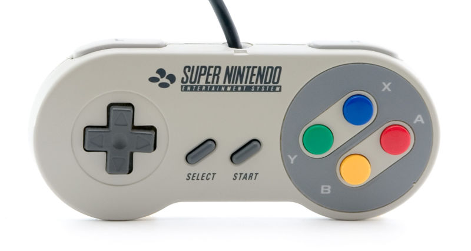
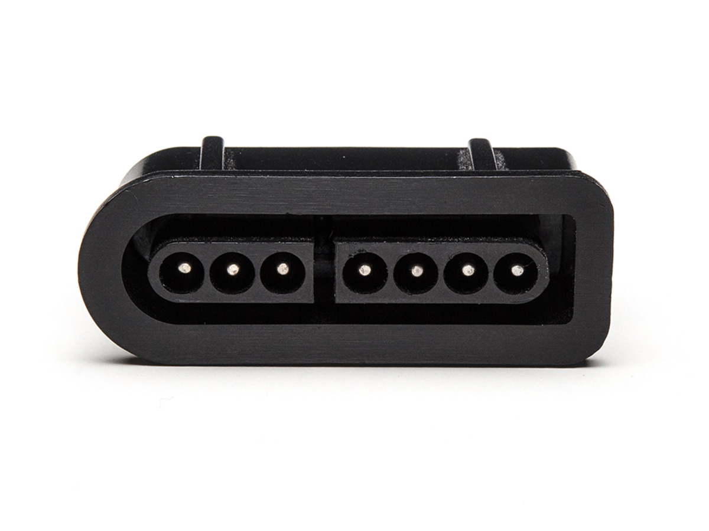

# SNES Controllers

## Pinout

| Pin | Description | Color of wire in cable  |
| === | =========== | ======================  |
| 1   | +5v         | White                   |
| 2   | Data clock  | Yellow                  |
| 3   | Data latch  | Orange                  |
| 4   | Serial data | Red                     |
| 5   | ?           | no wire                 |
| 6   | ?           | no wire                 |
| 7   | Ground      | Brown                   |

# Protocol

Every 16.67ms (or about 60Hz), the SNES CPU sends out a 12us wide, positive
going data latch pulse on pin 3. This instructs the ICs in the controller
to latch the state of all buttons internally. Six microsenconds after the
fall of the data latch pulse, the CPU sends out 16 data clock pulses on
pin 2. These are 50% duty cycle with 12us per full cycle. The controllers
serially shift the latched button states out pin 4 on every rising edge
of the clock, and the CPU samples the data on every falling edge.

Each button on the controller is assigned a specific id which corresponds
to the clock cycle during which that button's state will be reported.
The table in section 4.0 lists the ids for all buttons. Note that
multiple buttons may be depressed at any given moment. Also note
that a logic "high" on the serial data line means the button is NOT
depressed.

At the end of the 16 cycle sequence, the serial data line is driven low
until the next data latch pulse. The only slight deviation from this
protocol is apparent in the first clock cycle. Because the clock is
normally high, the first transition it makes after latch signal is
a high-to-low transition. Since data for the first button (B in this
case) will be latched on this transition, it's data must actually be
driven earlier. The SNES controllers drive data for the first button
at the falling edge of latch. Data for all other buttons is driven at
the rising edge of clock. Hopefully the following timing diagram will
serve to illustrate this. Only 4 of the 16 clock cycles are shown for
brevity.

| Clock Cycle | Button Reported    |
| =========== | ===============    |
| 1           | B                  |
| 2           | Y                  |
| 3           | Select             |
| 4           | Start              |
| 5           | Up on joypad       |
| 6           | Down on joypad     |
| 7           | Left on joypad     |
| 8           | Right on joypad    |
| 9           | A                  |
| 10          | X                  |
| 11          | L                  |
| 12          | R                  |
| 13          | none (always high) |
| 14          | none (always high) |
| 15          | none (always high) |
| 16          | none (always high) |

## references

[Super Nintendo Entertainment System: pinouts & protocol](https://gamefaqs.gamespot.com/snes/916396-super-nintendo/faqs/5395)

[Snes CONtroller Emulator using Arduino](https://github.com/jtrinklein/SConE)

[NES/SNES protocol](http://uzebox.org/files/NES-controller-Hydra-Ch6All-v1.0.pdf)
