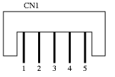

# dreamcast controllers spec

## dreamcast controller socket (Maple bus)

Female



Male


Pinouts

| 1 | red   | serial data                                         |
| 2 | blue  | +5V                                                 |
| 3 | black | GND                                                 |
| 4 | green | sense (connected to GND inside controller/keyboard) |
| 5 | white | serial data (3v?)

The comunication is done in two phases
Phase 1: pin 1 is clock and pin 5 is data.
Phase 2, pin 5 is clock and pin 1 is data.

In each phase, which lasts for 0.5µs, a single bit of data is transferred                                  |


### Idle

While on Idle state pin 1 and 5 will be 1

### Sync (wakeup)

| Pin 1 | 1 | 0 | 0 | 0 | 0 | 0 | 0 | 0 | 0 | 1 |
| Pin 5 | 1 | 0 | 1 | 0 | 1 | 0 | 1 | 0 | 1 | 0 |

After sync phase 1 starts.

### Checksum

8-bit bytewise XOR checksum. This checksum is sent immediately after the frame data

```c
// this need to be added as last byte
char mapple_checksum(unsigned char *data, int size) {
  char lrc = 0;
  int i;
  for (i = 0; i < size; ++i) {
    lrc ^= data[i];
  }

  return lrc;
}
```

### Closing secuence

| Pin 1 | 1 | 1 | 1 | 0 | 1 | 0 | 1 | 0 | 1 |
| Pin 5 | 0 | 1 | 0 | 0 | 0 | 0 | 0 | 0 | 1 |

## references

[Dreamcast controller to USB build log](https://www.raphnet.net/programmation/dreamcast_usb/index_en.php)

[packet example](http://www.otenko.com/dreamcast/dreamcast-packet.png)

[Maple bus to usb adaptor](http://mc.pp.se/dc/dchid.html)

[Dreamcast Controller pinouts](http://mc.pp.se/dc/controller.html)

[Maple wire protocol](http://mc.pp.se/dc/maplewire.html)

[Similar documentation gathering](https://github.com/nukru/ACDCW/tree/master/Documentation)

[Sega Dreamcast Maplebus Transceiver](https://github.com/ismell/maplebus)
