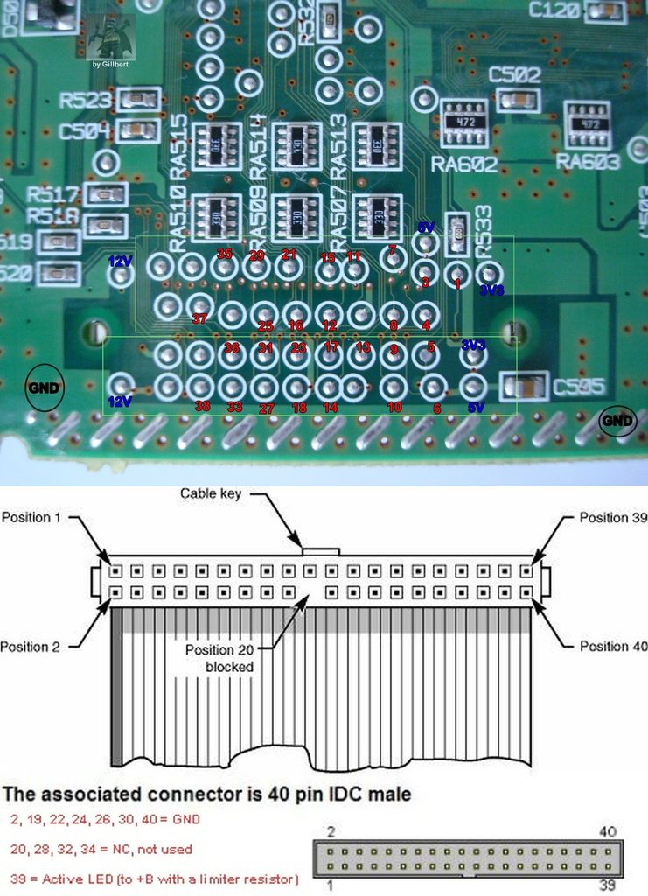
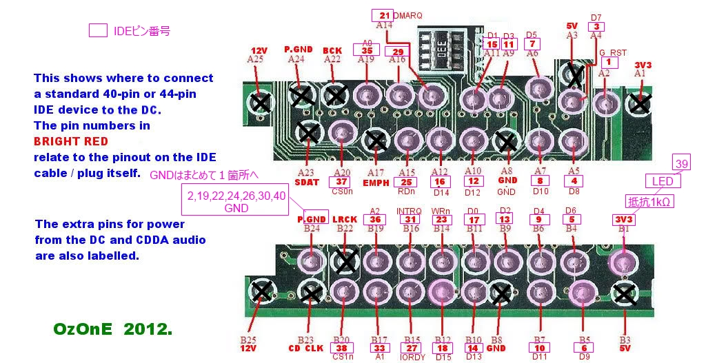

# sega dreamcast hdd

# references

[Roughly drawn out pin out for IDE 44 to DC GDRom](https://plus.google.com/photos/+LesRailton/albums/6021215859466875073/6025253670679314338?pid=6025253670679314338&oid=106929866019169011552)

[his is looking underside of the DC board near the GD ROM connector](https://plus.google.com/photos/+LesRailton/albums/6021215859466875073/6025253670260501186?pid=6025253670679314338&oid=106929866019169011552)

[G1-ATA (IDE) adapter](http://www.dc-swat.ru/blog/hardware/874.html)

[How To Attach A Hard Drive To The Sega Dreamcast & Load Games Via Dreamshell](http://www.retrocollect.com/News/how-to-attach-a-hard-drive-to-the-sega-dreamcast-a-load-games-via-dreamshell.html)

[DreamShell 4.0.0 RC 2 (追記)](https://ayasuke2.exblog.jp/22180838/)

[Dreamcast Hacks images](https://plus.google.com/photos/+LesRailton/albums/6021215859466875073)

[[MOD] HDD without destroying your DREAMCAST → Step by Step Guide](https://assemblergames.com/threads/mod-hdd-without-destroying-your-dreamcast-→-step-by-step-guide.60146/)

[Dream IDE Reborn v4](https://gametrackssite.wordpress.com/)
