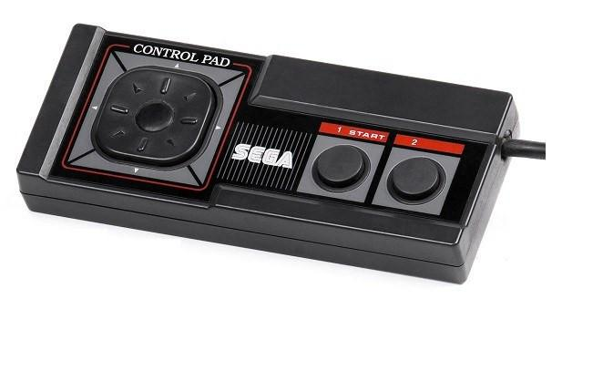
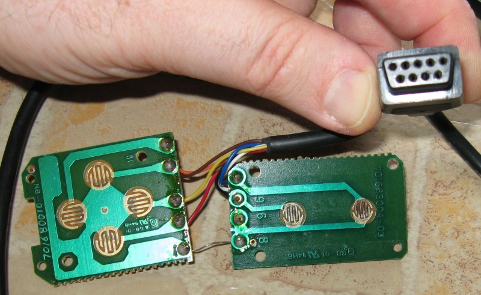
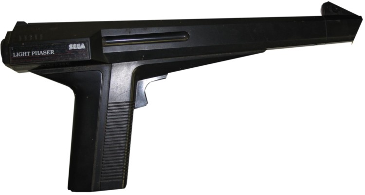

# sega master system controllers specs

## master system controller socket (Arari port)

No signal is needed unlike megadrive.

| Pin # | Signal Name |
| 1     | D0          |
| 2     | D1          |
| 3     | D2          |
| 4     | D3          |
| 5     | +5V         |
| 6     | D4          |
| 7     | Select (TH) |
| 8     | GND         |
| 9     | D5          |

* pressed = 0v
* released = 5v

## master system controller

Pins used:

| D0              | Up    |
| D1              | Down  |
| D2              | Left  |
| D3              | Right |
| D4              | 1     |
| D5              | 2     |

## Light Phaser

Pins used:

| D4 | trigger      |
| TH | light sensor |

# references

[The Genesis / Megadrive Joypad Protocol](https://db-electronics.ca/console-tech/sega-genesis-megadrive/joypad/)

[Atari interface](https://deskthority.net/wiki/Atari_interface#Sega_16-bit)

[Light Phaser](https://segaretro.org/Light_Phaser)

