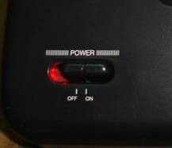
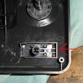
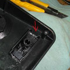
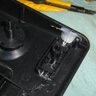

# Sega master system 2 power led

## Result

## Installation

Debemos intercalar una resistencia de 100 ohmios en cualquier pata del LED.

## Videos

* [Sega Master System 2 Detailed Mods Tutorial - RGB SCART | 60hz | Power LED | Controller Pause](https://www.youtube.com/watch?v=syeN58Osg24)
