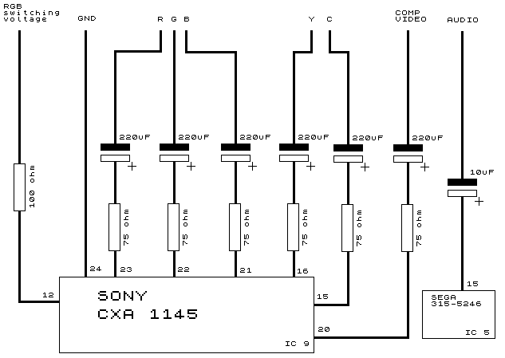
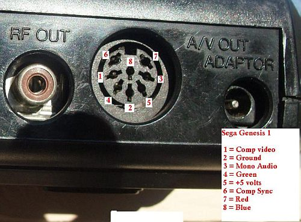
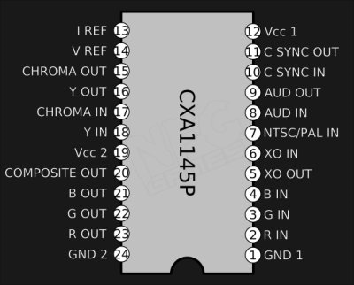

# Sega Master System II (2) RGB mod

This mods try to convert a sega master system 2 into a sega saturn compatible
output.

So you need to output a 10 pin din.

Chips involved: SONY CXA 1145 y sega 315-5246

Output

Note when wiring the back, flip your mind :)

## CXA1145P pinouts

* pin 16 Composite sync (H+V sync)
* pin 16 Luma 27 ohm (Y)
* pin 15 Chroma 465 ohm (C)
* pin 20 Composite
* pin 21 Blue
* pin 22 Green
* pin 23 Red

## Parts

## Parts

## Videos

* [Sega Master System 2 Detailed Mods Tutorial - RGB SCART | 60hz | Power LED | Controller Pause](https://www.youtube.com/watch?v=syeN58Osg24)

* [Sega Master System 2 - Part 2 - 50/60Hz Switch Mod & RGB AV Port Out Mod](https://www.youtube.com/watch?v=EwZoASNpmys)

## references

http://www.diffusedion.co.uk/MS2RGB.html
