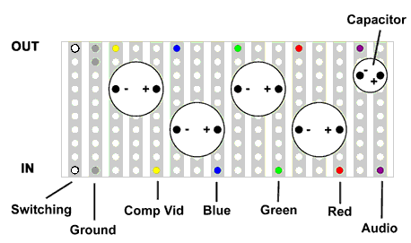
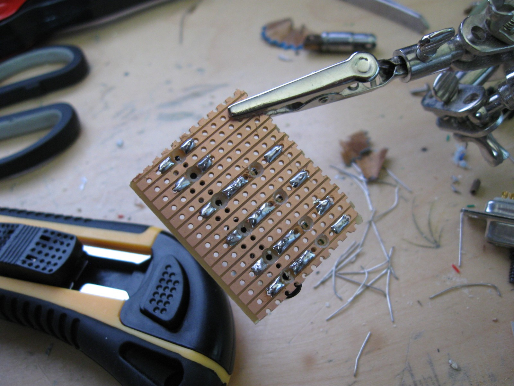
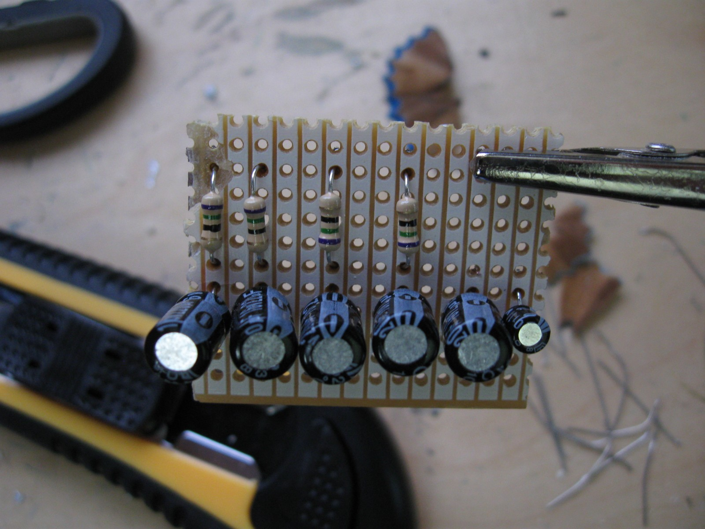

# Sega Master System II (2) RGB mod

This mods try to convert a sega master system 2 into a sega saturn compatible
output.

So you need to output a 10 pin din.

Chips involved: SONY CXA 1145 y sega 315-5246

Output

Note when wiring the back, flip your mind :)

## CXA1145P pinouts

* pin 16 Composite sync (H+V sync)
* pin 16 Luminance (Luma/Intensity) 27 ohm (Y)
* pin 15 Chrominance (Chroma/Color) 465 ohm (C)
* pin 20 Composite
* pin 21 Blue
* pin 22 Green
* pin 23 Red

## Parts

### RGB + bypass

* 1x [THS7314](https://es.aliexpress.com/item/Free-shipping-10pcs-THS7314DRG4-SMD-Amplifier-SOIC8-THS7314/32821904221.html) (with low pass filter) or [THS7316](https://es.aliexpress.com/item/10-piezas-THS7316DR-THS7316D-THS7316-7316-sop-8-Chipset-nuevo-original/32896846282.html) (without low pass filter)
* 3x 82nf Ceramic Capacitor (RGB line) [823 82NF](https://es.aliexpress.com/item/50-Unid-monol-tico-condensador-392-393-470-471-473-474-475-561-562-820-823/32865098105.html)
* 1x 100nf Ceramic Capacitor [
MCIGICM 100nf](https://es.aliexpress.com/store/product/300pF-301-99030-Free-shipping-1000pcs-50value-50V-Ceramic-Capacitor-Assorted-kit-Assortment-Set-300pF-301/506373_32373022357.html)
* 1x 22µF Ceramic Capacitor [lot](https://es.aliexpress.com/item/12valuesX10pcs-120pcs-0-22UF-470UF-Aluminum-electrolytic-capacitors-Assorted-Kit/32345937589.html)
* 3x 3.6 mohm resistors

* 4x 220µF 10v electrolytic Capacitors (RGB + composite) [lot](https://es.aliexpress.com/item/12valuesX10pcs-120pcs-0-22UF-470UF-Aluminum-electrolytic-capacitors-Assorted-Kit/32345937589.html)
* 1x 10µF 10v electrolytic Capacitor
* 3x 75 ohm resistors (RGB)

### For Din output (extra parts)

* mini DIN 9

### For Scart output (extra parts)

* 1 100 ohm resistor (RGB Switch)
* Female SCART

### Optional

* Single Row Male and Female 2.54 Breakable Pin Header Connector Strip
* 40Pin 30cm Jumper Wire Dupont Cable Dupont Line (male - female)

## Board

3.6MΩ / 3.6MΩ pull-up resitor into a 82nf capacitor into R/G/B of THS7314.
R/G/B output THS7314 goes into a 75Ω resitor into a 220µF capacitor.

## Videos

* [Sega Master System 2 Detailed Mods Tutorial - RGB SCART | 60hz | Power LED | Controller Pause](https://www.youtube.com/watch?v=syeN58Osg24)

* [Sega Master System 2 - Part 2 - 50/60Hz Switch Mod & RGB AV Port Out Mod](https://www.youtube.com/watch?v=EwZoASNpmys)

## references

http://www.mmmonkey.co.uk/console/sega/sms2-av.htm

http://www.diffusedion.co.uk/MS2RGB.html

https://assemblergames.com/threads/whats-currently-the-best-rgb-mod-for-the-pc-engine.45483/

## shopping

[Printed circuit board mount scart female euro connector](https://www.electronicaembajadores.com/en/Productos/Detalle/CT99CHP/connectors/scart-connectors/printed-circuit-board-mount-scart-female-euro-connector)

[10.356 SCART FEMALE PANEL MOUNT FOR PCB](https://www.cetronic.es/sqlcommerce/disenos/plantilla1/seccion/producto/DetalleProducto.jsp?idIdioma=1&idTienda=93&codProducto=999019156&cPath=502)

[220µF 10v Capacitors](https://www.electronicaembajadores.com/en/Productos/Detalle/COEL22710-85/capacitors/electrolytic-capacitors/radial-electrolytic-capacitor-220-µF-10-v)

[220µF 10v Capacitors](https://www.electronicaembajadores.com/en/Productos/Detalle/COEL22710/capacitors/electrolytic-capacitors/radial-electrolytic-capacitor-220-µF-10-v-105-c)

## bypass-board

https://nfggames.com/forum2/index.php?PHPSESSID=ck03v0rtnm64nn8pllhbidtho6&topic=4822.40

https://oshpark.com/shared_projects/Ntagdloi

I don't know why it seems like people are using 5.1 MOhm pull-up resistors by default. I've also arised that question on the assemblergames forums but I haven't received an answer yet.
For me a 3.6 MOhm pull-up resistor seems more suited for the application. And when using a 3.6 MOhm pull-up, the value of the input cap should be 82 nF to get a cutoff frequency of 3 Hz as suggested in the datasheet

using 100 nF input caps and 220 µF output caps instead of 82 nF and 330 µF. That's about the only differences...

3.6k is a better choice

 PC Engine is not 0.7 Vpp, it's actually 0.8 Vpp (I know because I bought a PC Engine a few months ago). To compensate for this I suggest attenuating the output slightly. Instead of a 75 ohm resistor in series with the output, you could use 86 ohms in series and 586 ohms to ground
