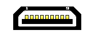

# saturn controllers spec

## sega saturn controller socket

### Male socket (controller)



### Female socket (console)

```
/-----------\
| 987654321 |
|___________|
```

| pin # | Name | Function                    |
|-------|------| ----------------------------|
| 1     | VCC  | +5v (Out)                   |
| 2     | D1   | Data 1                      |
| 3     | D0   | Data 0                      |
| 4     | S0   | Request (Select 1, aka TR)  |
| 5     | S1   | Select (Select 0, aka TH)   |
| 6     | S3   | Acknowledge (TL)            |
| 7     | D3   | Data 3                      |
| 8     | D2   | Data 2                      |
| 9     | GND  | Ground                      |

S0, S1 are console signal pins ( INPUT )

S3 is a controller signal output ( OUTPUT )

D1, D0, D2, D3 are Data pins, nibble by nibble ( OUTPUT )

## sega saturn 6 buttons controller (MK-80100 / MK-80114 / MK-80116 / MK-80301 / MK-80313 / RG-CP5 / RG-CP6)

S3 = 5v always

| REQ | SEL | D0 | D1    | D2    | D3     |
|-----|-----|----|-------|-------|--------|
| Off | Off | Z  | Y     | X     | R      |
| On  | Off | B  | C     | A     | Start  |
| Off | On  | Up | Down  | Left  | Right  |
| On  | On  | -  |  -    |  -    | L      |

## 3d control pad (Mk-80117 / HSS-0137)

| REQ  | SEL | ACK | D0 | D1    | D2    | D3     |
|------|-----|-----|----|-------|-------|--------|
| On   | On  | 0   | 0  | 0     | 0     | 0      |
| Off  | Off | 1   | 0  | 1     | 0     | 0      |
| On   | Off | 0   | Up | Down  | Left  | Right  |
| Off  | Off | 1   | C  | B     | A     | Start  |
| On   | Off | 0   | Z  | Y     | X     | R/1    |
| Off  | Off | 1   | 1  | 1     | 1     | L/1    |
| On   | Off | 0   | 0  | 0     | 0     | 0      |
| Off  | Off | 1   | 1  | 0     | 0     | 0      |

First byte: hello!

Second/Third byte: buttons state

Fouth byte: bye!

## references

[Saturn Control Pad](https://segaretro.org/Control_Pad_\(Saturn\))

[Saturn 3D Control Pad](https://segaretro.org/3D_Control_Pad)

[Saturn Controller Protocol MK-80117 and Emulation](https://nfggames.com/forum2/index.php?topic=5055.0)

[controller schematics](https://gamesx.com/grafx/saturn.gif)

[Sega Saturn Pad Info](https://gamesx.com/controldata/saturn.htm)

[USB SFC/SNES and Saturn Controller](https://github.com/bkoropoff/sfcusb)

[Dual Shock 4 controller to Sega Saturn adapter using an Arduino with a USB Shield](https://github.com/garybethel/DS4toSaturn)

[Saturn_Controller_Demux](https://github.com/Arthrimus/Saturn_Controller_Demux/blob/master/saturn_controller_demux/saturn_controller_demux.ino)

[Saturn 3d impl](https://github.com/fluxcorenz/UPCB/blob/master/saturn3d.c)
