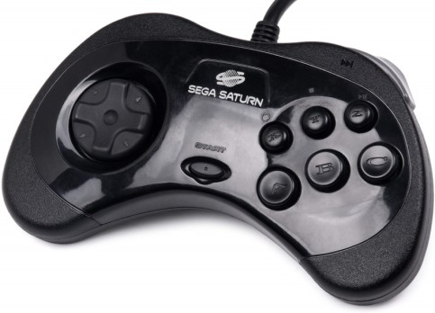

# Sega Saturn controllers spec

## Male socket (controller)


## Female socket (console)

```
╭───────────╮
| 987654321 |
└───────────┘
```


| pin # | Name | Function                    | Color[1] |
|-------|------| ----------------------------|----------|
| 1     | VCC  | +5v (Out)                   | Red      |
| 2     | D1   | Data 1 (D)                  | White    |
| 3     | D0   | Data 0 (U)                  | Yellow   |
| 4     | S0   | Request (Select 1 / TR)     | Orange   |
| 5     | S1   | Select (Select 0 / TH)      | Blue     |
| 6     | S3   | Acknowledge (TL)            | Green    |
| 7     | D3   | Data 3 (R)                  | Black    |
| 8     | D2   | Data 2 (L)                  | Brown    |
| 9     | GND  | Ground                      | Purple   |

[1] Extension cable colors (not original pad)

S0, S1 are console signal pins ( INPUT )

S3 is a controller signal output ( OUTPUT )

D1, D0, D2, D3 are Data pins, nibble by nibble ( OUTPUT )

## Sega Saturn 6 buttons controller (MK-80100 / MK-80114 / MK-80116 / MK-80301 / MK-80313 / RG-CP5 / RG-CP6)



ACK = 5v always

| REQ | SEL | D0 | D1    | D2    | D3     |
|-----|-----|----|-------|-------|--------|
| Off | Off | Z  | Y     | X     | R      |
| On  | Off | B  | C     | A     | Start  |
| Off | On  | Up | Down  | Left  | Right  |
| On  | On  | -  |  -    |  -    | L      |

## 3D Control pad (MK-80117 / HSS-0137)

| REQ  | SEL | ACK | D0 | D1    | D2    | D3     |
|------|-----|-----|----|-------|-------|--------|
| On   | On  | 0   | 0  | 0     | 0     | 0      |
| Off  | Off | 1   | 0  | 1     | 0     | 0      |
| On   | Off | 0   | Up | Down  | Left  | Right  |
| Off  | Off | 1   | B  | C     | A     | Start  |
| On   | Off | 0   | Z  | Y     | X     | R/1    |
| Off  | Off | 1   | 1  | 1     | 1     | L/1    |
| On   | Off | 0   | 0  | 0     | 0     | 0      |
| Off  | Off | 1   | 1  | 0     | 0     | 0      |

It transfer 4 bytes (8 nibbles):

* hello
* button state 1
* button state 2
* bye

## References

[SMPC User's Manual - Page 86-103](https://antime.kapsi.fi/sega/files/ST-169-R1-072694.pdf) This document contains everything!

[Saturn Control Pad](https://segaretro.org/Control_Pad_\(Saturn\))

[Saturn 3D Control Pad](https://segaretro.org/3D_Control_Pad)

[Saturn Controller Protocol MK-80117 and Emulation](https://nfggames.com/forum2/index.php?topic=5055.0)

[controller schematics](https://gamesx.com/grafx/saturn.gif)

[Sega Saturn Pad Info](https://gamesx.com/controldata/saturn.htm)

[USB SFC/SNES and Saturn Controller](https://github.com/bkoropoff/sfcusb)

[Dual Shock 4 controller to Sega Saturn adapter using an Arduino with a USB Shield](https://github.com/garybethel/DS4toSaturn)

[Saturn_Controller_Demux](https://github.com/Arthrimus/Saturn_Controller_Demux/blob/master/saturn_controller_demux/saturn_controller_demux.ino)

[Saturn 3d impl](https://github.com/fluxcorenz/UPCB/blob/master/saturn3d.c)

https://github.com/NoahSteam/RomHackingTools/blob/cff6a1ae12b3106e705e3749ecc98589f399b287/Docs/Saturn/SaturnMemory.txt#L125

https://www.raphnet.net/electronique/saturn_usb/index_en.php


http://spritesmods.com/?art=xpad&page=5
