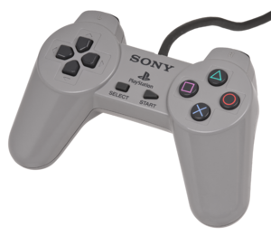
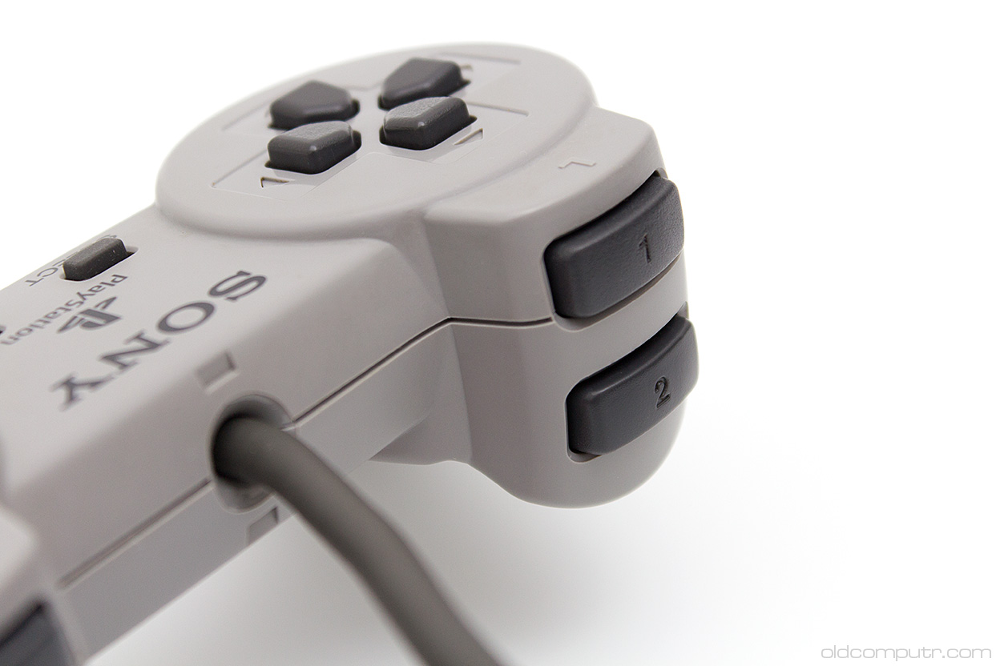
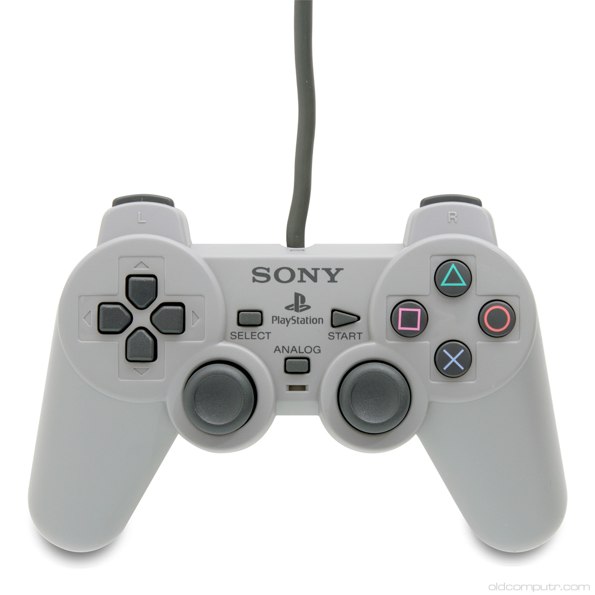
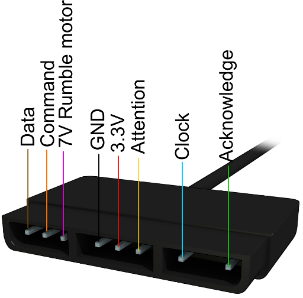

# Playstation (PSOne, PSX) controllers

## Playstation controllers

### Original




### Dualshock



## Playstation controllers socket & Pinouts



## Pinouts (console side)
```
┌───────────┐
│○○○|○○○|○○○│
╰───────────╯
┌───────────┐
│123|456|789│
╰───────────╯
```

| Pin | Signal    | Color[1]  |
| --- | --------- | --------- |
| 1   | ACK       | Green     |
| 2   | Unused    | ??        |
| 3   | Clock     | Blue      |
| --- | --------- | --------- |
| 4   | Attention | Yellow    |
| 5   | Vcc 3v3   | Red       |
| 6   | GND       | Purple    |
| --- | --------- | --------- |
| 7   | Vcc 7v    | White     |
| 8   | Command   | Orange    |
| 9   | Data      | Gray      |

[1] Color of my extension

## Protocol

```
       │12μs │12μs │12μs │12μs │12μs │12μs │12μs │12μs │
      ─┐  ┌──┐  ┌──┐  ┌──┐  ┌──┐  ┌──┐  ┌──┐  ┌──┐  ┌───
Clock  └──┘  └──┘  └──┘  └──┘  └──┘  └──┘  └──┘  └──┘
Data   │  0  │  1  │  2  │  3  │  4  │  5  │  6  │  7  │
CMMD   │  0  │  1  │  2  │  3  │  4  │  5  │  6  │  7  │
                                                 ┌──┐
ACK ─────────────────────────────────────────────┘  └──┘
```

When the clock is FALLING the values on the line start to change.

When the clock is RISING value are actually read.

Bytes are transferred LSB (least significant bit)


               |BIT 0|BIT 1|BIT 2|BIT 3|BIT 4|BIT 5|BIT 6|BIT 7|
    CLOCK -----___---___---___---___---___---___---___---___-----------

    DATA  -----000000111111222222333333444444555555666666777777--------
                  *     *     *     *     *     *     *     *
    CMND  -----000000111111222222333333444444555555666666777777--------

    ACK   ----------------------------------------------------------__-


## Commands

### Request ID: 0x01

Controller must repond with:
* ID
  * 0x41=Digital
  * 0x23=NegCon
  * 0x73=Analogue Red LED
  * 0x53=Analogue Green LED

   0x1=Mouse
   0x4=Digital
   0x2=NeGcon
   0x7=Analog
   0x5=Flight Stick
   0xF=Escape

### Request state: 0x42

Controller respond: 0x5A + two bytes


## Controller Button Mapping:

### Mouse (0x1)

Byte 1: Always 0xFF

Byte 2: Left Button (0x02), Right Button (0x04)

Byte 3: Delta Vertical

Byte 4: Delta Horizontal


### NeGcon (0x2)

Byte 1: Start (0x08), Up (0x10), Right (0x20), Down (0x40), Left (0x80)

Byte 2: R1 (0x08), A (0x10), B (0x20)

Byte 3: Steering (0x00 = Right, 0xFF = Left)

Byte 4: I Button (0x00 = Out, 0xFF = In)

Byte 5: II Button (0x00 = Out, 0xFF = In)

Byte 6: L1 Button (0x00 = Out, 0xFF = In)


### Digital (0x4)

Byte 1: Select (0x01), Start (0x08), Up (0x10), Right (0x20), Down (0x40), Left (0x80)

Byte 2: L2 (0x01), R2 (0x02), L1 (0x04), R1 (0x08), Triangle (0x10), Circle (0x20), Cross (0x40), Square (0x80)


### Flight Stick (0x5)

Byte 1: Start (0x08), Up (0x10), Right (0x20), Down (0x40), Left (0x80)

Byte 2: L2 (0x01), L1 (0x02), Square (0x04), Triangle (0x08), R1 (0x10), Circle (0x20), Cross (0x40), R2 (0x80)

Byte 3: RStick X (0x00 = Left, 0xFF = Right)

Byte 4: RStick Y (0x00 = Up, 0xFF = Down)

Byte 5: LStick X (0x00 = Left, 0xFF = Right)

Byte 6: LStick Y (0x00 = Up, 0xFF = Down)


### Analog (0x7)

Byte 1: Select (0x01), R3 (0x02), L3 (0x04), Start (0x08), Up (0x10), Right (0x20), Down (0x40), Left (0x80)

Byte 2: L2 (0x01), R2 (0x02), L1 (0x04), R1 (0x08), Triangle (0x10), Circle (0x20), Cross (0x40), Square (0x80)

Byte 3: RStick X (0x00 = Left, 0xFF = Right)

Byte 4: RStick Y (0x00 = Up, 0xFF = Down)

Byte 5: LStick X (0x00 = Left, 0xFF = Right)

Byte 6: LStick Y (0x00 = Up, 0xFF = Down)


## references

* https://gamesx.com/controldata/psxcont/psxcont.htm

* https://allpinouts.org/pinouts/connectors/videogame/sony-playstation-psx-joystick-controller-port/

* https://store.curiousinventor.com/guides/PS2

* https://gist.github.com/scanlime/5042071

* https://pspunch.com/pd/article/arduino_lib_gpsx_en.html

* https://skinnysatan.com/2013/07/27/interface-playstation-joystick-to-avr-microcontroller/

https://github.com/GiuseppePorcheddu/PsxLib/blob/master/PsxLib.h
https://github.com/kiram9/Arduino_PSX_Analog/blob/master/Psx_analog.cpp
https://github.com/SukkoPera/PsxNewLib/blob/master/src/PsxNewLib.h
https://github.com/jihad22/robotpsx/blob/master/PS2X_lib/PS2X_lib.cpp
https://github.com/Danjovic/psxController

* https://store.curiousinventor.com/guides/PS2#hardware
* http://svn.navi.cx/misc/trunk/unicone2/psx-base/psx_controller_emulator.spin


* [ps2 keyboard](https://www.avrfreaks.net/forum/ps2-controller-data-transfer-using-bluetooth-module-hc-05)
